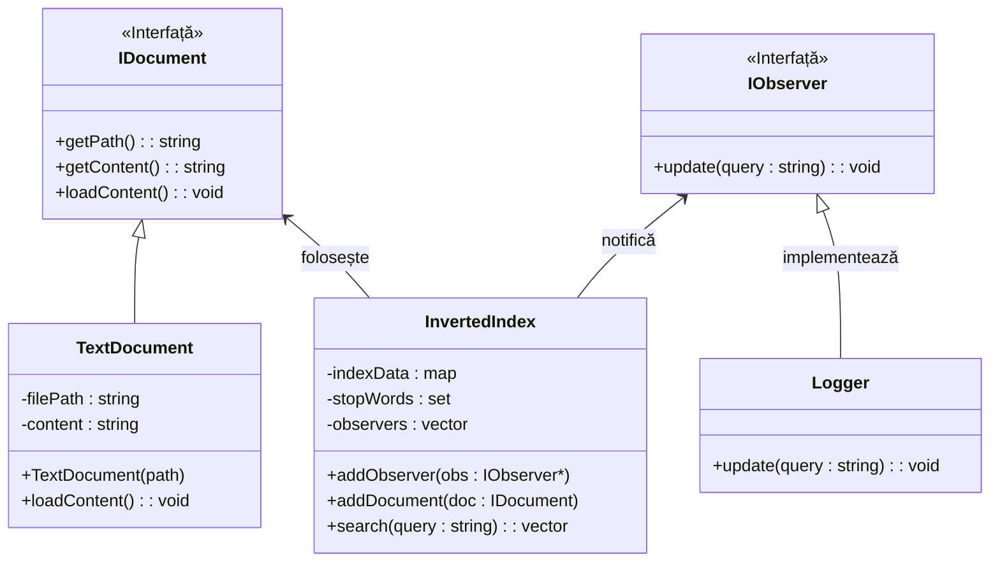

# POO_Alberto_Nichitean_3123B

Acest repository conține activitatea desfășurată la disciplina POO.

# 🔍 Proiect POO - Motor de Căutare pentru Documente Text

**Student:** Nichitean Alberto | **Grupa:** 3123B | **Tehnologii:** C++17, STL, CMake

Proiectul implementează un motor de căutare de tip *Inverted Index*, capabil să scaneze dinamic directoare, să proceseze textul (eliminând semnele de punctuație și cuvintele de legătură) și să rezolve interogări logice complexe, totul rulând printr-o interfață consolă interactivă.

## 📋 Stadiu Cerințe și Funcționalități

| Cerință | Tip | Status | Detalii Implementare |
| :--- | :---: | :---: | :--- |
| **Clasa Document** (cale, conținut) | Obligatoriu | ✅ | `TextDocument` implementează interfața `IDocument`. |
| **Clasa Index** (`std::map`) | Obligatoriu | ✅ | Căutare rapidă $O(\log n)$ folosind `map<string, vector>`. |
| **Încărcare dinamică din director** | Obligatoriu | ✅ | Utilizare `std::filesystem` pentru citirea folderelor. |
| **Manipulare String-uri** | Obligatoriu | ✅ | Transformare `tolower` și eliminare punctuație. |
| **Teste Unitare** | Facultativ (Bonus)| ✅ | Suită izolată în `tests/test_index.cpp` folosind `assert`. |
| **Eliminare Stop-words** | Facultativ (Bonus)| ✅ | Filtrare prin `std::set` a cuvintelor ("și", "în", "la" etc.). |
| **Căutare Avansată (AND / OR)** | Facultativ (Bonus)| ✅ | Suport pentru intersecție (AND) și reuniune (OR). |
| **Observer Pattern (Logger)** | Facultativ (Bonus)| ✅ | Decuplarea sistemului de logare a căutărilor de Index. |

## 🚀 Evoluția Proiectului (Istoric)

## 📂 Întâlnirea 1: Structura de bază

### În folderul `src/` (Cod Sursă):

* **`IDocument.h`**: Am creat această interfață pentru a defini ce înseamnă un document în sistemul meu (Abstractizare).

* **`TextDocument.h` & `.cpp`**: Am implementat clasa cerută pentru documente text. Aceasta moștenește `IDocument` și gestionează calea fișierului și conținutul acestuia.

* **`InvertedIndex.h` & `.cpp`**: Am adăugat "creierul" motorului de căutare, care folosește un `std::map` pentru a lega cuvintele de documente.

### În folderul `docs/` (Documentație):

* **`documentatie.md`**: Am explicat pe scurt analiza temei și conceptele de POO folosite.

* **`diagrama_uml.png`**: Am inclus o schiță vizuală a claselor mele pentru a arăta relația de moștenire.

---

## 🚀 Întâlnirea 2: Excepții, Optimizări și Testare

### Noutăți în cod:

* **`IndexException.h`**: Am adăugat o clasă proprie de excepții (moștenită din `std::exception`) pentru a trata elegant erorile (ex: fișiere care nu pot fi deschise).

* **Filtru Stop-Words (`InvertedIndex`)**: Am adăugat un `std::set` pentru a ignora cuvintele scurte sau de legătură ("și", "în", "la"), optimizând astfel căutarea.

* **Consolă Interactivă (`main.cpp`)**: Am refactorizat main-ul pentru a genera automat fișiere de test și a permite utilizatorului să caute cuvinte în buclă (`while`), demonstrând polimorfismul și prinderea excepțiilor (`try-catch`).

* **`tests/test_index.cpp`**: Am creat un fișier separat pentru testarea unitară folosind `assert()`, validând logica de căutare și filtrare.

---

## 🌟 Întâlnirea 3: Funcționalități Avansate și Design Patterns

### Noutăți în cod:

* **Încărcare Automată (`std::filesystem`)**: Programul nu mai folosește fișiere hardcodate. Acum scanează automat un folder țintă (`documente_test`) și încarcă în memorie toate fișierele valide găsite.

* **Căutare Avansată (AND / OR)**: Am extins logica de căutare pentru a permite interogări complexe folosind operatori logici (ex: `teoria AND fizica` sau `cod OR domnitor`).

* **Design Pattern Observer (`IObserver` & `Logger`)**: Am implementat un sistem de monitorizare decuplat. Motorul de căutare notifică automat Logger-ul la fiecare acțiune, care salvează istoricul căutărilor atât în consolă, cât și într-un fișier local (`search_history.log`).

* **Meniu Principal Interactiv**: Am restructurat `main.cpp` pentru a oferi un meniu numeric complet utilizatorului, tratând input-urile invalide.

---

## 🛠️ Cum se compilează și rulează (Linux / WSL)

Proiectul folosește CMake pentru managementul build-ului.

1. **Configurare și Compilare:**
   ```bash
   mkdir build
   cd build
   cmake ..
   make
   ```

2. **Rulare aplicație principală (meniu interactiv):**
   ```bash
   ./app
   ```

3. **Rulare teste automate:**
   ```bash
   ./run_tests
   ```

---

## Arhitectura și Tehnologie (Diagrama UML)

Mai jos este structura claselor, ilustrând conceptele de **Moștenire** (TextDocument derivă din IDocument), **Polimorfism** și implementarea tiparului **Observer**.



---

## 🖥️ Exemplu de Rulare (Sesiune în Consolă)

```text
=== Motor de Cautare Documente (Faza 3 FINAL) ===

[INFO] Se pregatesc documentele din folderul 'documente_test'...
  -> Gasit si pregatit: documente_test/istoric.txt
  -> Gasit si pregatit: documente_test/programare.txt
  -> Gasit si pregatit: documente_test/stiinta.txt

[INFO] Se incepe indexarea...
[INFO] Indexare completata cu succes!

================================================
             MENIU MOTOR DE CAUTARE             
================================================
 1. Efectueaza o cautare (Simpla sau AND/OR)
 2. Afiseaza documentele indexate in sistem
 0. Iesire program
------------------------------------------------
Alege o optiune: 2

[ DOCUMENTE INCARCATE ]
    - documente_test/istoric.txt
    - documente_test/programare.txt
    - documente_test/stiinta.txt

================================================
             MENIU MOTOR DE CAUTARE             
================================================
 1. Efectueaza o cautare (Simpla sau AND/OR)
 2. Afiseaza documentele indexate in sistem
 0. Iesire program
------------------------------------------------
Alege o optiune: 1

-> Introdu un cuvant (ex: 'teoria') sau o cautare avansata (ex: 'teoria AND fizica'):
Cauta: programator AND index

[LOGGER] A fost efectuata o cautare pentru: 'programator AND index'

[ REZULTATE ]
    - Document: documente_test/programare.txt

================================================
             MENIU MOTOR DE CAUTARE             
================================================
 1. Efectueaza o cautare (Simpla sau AND/OR)
 2. Afiseaza documentele indexate in sistem
 0. Iesire program
------------------------------------------------
Alege o optiune: 0

Program incheiat curat. La revedere!

* **Căutare Rapidă și Case-Insensitive**: Căutările folosesc `std::map`, oferind un timp de acces foarte rapid ($O(\log n)$). Mai mult, căutarea nu ține cont de litere mari/mici (`Fizica` este tratat identic cu `fizica`).

### 💡 De ce am folosit Observer Pattern?

* **Decuplare totală:** Motorul de căutare (`InvertedIndex`) nu știe și nu îi pasă de existența Logger-ului. El doar strigă „S-a făcut o căutare!”, iar oricine este interesat ascultă.

* **Extensibilitate:** Pe viitor, putem adăuga un sistem care trimite un email la fiecare căutare, fără să modificăm nicio linie din clasa motorului de căutare.


