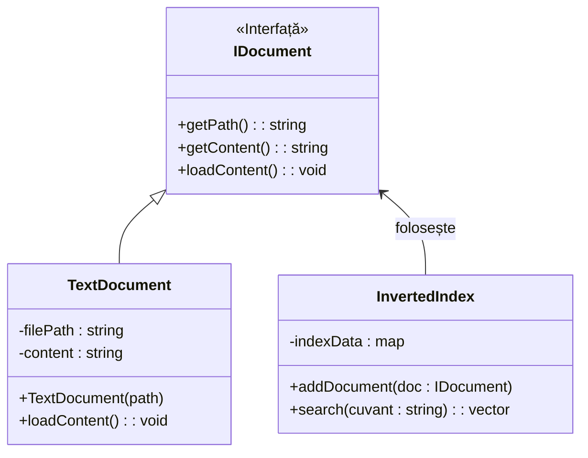

# POO_Alberto_Nichitean_3123B

Acest repository conține activitatea desfășurată la disciplina POO.

# Proiect POO - Motor de Căutare

**Student:** Nichitean Alberto | **Grupa:** 3123B

Acesta este proiectul meu pentru laboratorul de POO. Am pus la punct structura de bază, am integrat concepte avansate și m-am asigurat că totul rulează corect pe Linux (WSL).

## 📂 Întâlnirea 1: Structura de bază

### În folderul `src/` (Cod Sursă):

* **`IDocument.h`**: Am creat această interfață pentru a defini ce înseamnă un document în sistemul meu (Abstractizare).

* **`TextDocument.h` & `.cpp`**: Am implementat clasa cerută pentru documente text. Aceasta moștenește `IDocument` și gestionează calea fișierului și conținutul acestuia.

* **`InvertedIndex.h` & `.cpp`**: Am adăugat "creierul" motorului de căutare, care folosește un `std::map` pentru a lega cuvintele de documente.

### În folderul `docs/` (Documentație):

* **`documentatie.md`**: Am explicat pe scurt analiza temei și conceptele de POO folosite.

* **`diagrama_uml.png`**: Am inclus o schiță vizuală a claselor mele pentru a arăta relația de moștenire.

---

## 🚀 Întâlnirea 2: Excepții, Optimizări și Testare

### Noutăți în cod:

* **`IndexException.h`**: Am adăugat o clasă proprie de excepții (moștenită din `std::exception`) pentru a trata elegant erorile (ex: fișiere care nu pot fi deschise).

* **Filtru Stop-Words (`InvertedIndex`)**: Am adăugat un `std::set` pentru a ignora cuvintele scurte sau de legătură ("și", "în", "la"), optimizând astfel căutarea.

* **Consolă Interactivă (`main.cpp`)**: Am refactorizat main-ul pentru a genera automat fișiere de test și a permite utilizatorului să caute cuvinte în buclă (`while`), demonstrând polimorfismul și prinderea excepțiilor (`try-catch`).

* **`tests/test_index.cpp`**: Am creat un fișier separat pentru testarea unitară folosind `assert()`, validând logica de căutare și filtrare.

---

## 🛠️ Cum se compilează și rulează (Linux / WSL)

Proiectul folosește CMake pentru managementul build-ului.

1. **Configurare și Compilare:**
   ```bash
   mkdir build
   cd build
   cmake ..
   make
   ```

2. **Rulare aplicație principală (meniu interactiv):**
   ```bash
   ./app
   ```

3. **Rulare teste automate:**
   ```bash
   ./run_tests
   ```

---

## Arhitectura și Tehnologie (Diagrama UML)

Mai jos este structura claselor, ilustrând conceptele de **Moștenire** (TextDocument derivă din IDocument) și **Polimorfism**.

