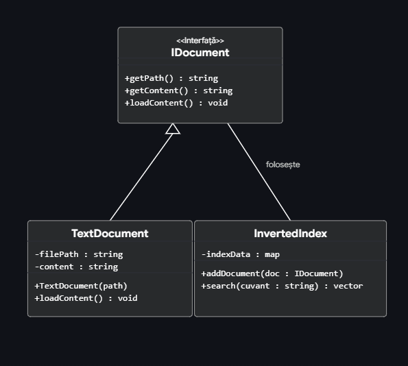

# Proiect POO: Motor de C?utare Documente (Tema 3123B)

## 1. Analiza Temei
Tema presupune realizarea unui sistem capabil s? indexeze documente text ?i s? permit? c?utarea eficient? a cuvintelor. Am ales o abordare modular? care s? permit? extinderea ulterioar? a tipurilor de documente suportate (ex: PDF sau HTML).

## 2. Clasele de Baz?
* **IDocument (Interfa??):** Clasa abstract? care define?te comportamentul obligatoriu pentru orice document (înc?rcare con?inut, ob?inere cale).
* **TextDocument:** Implementarea concret? pentru fi?iere de tip text, care mo?tene?te interfa?a IDocument.
* **InvertedIndex:** „Creierul” aplica?iei, care mapeaz? fiecare cuvânt c?tre lista de documente în care acesta apare.

## 3. Concepte POO Utilizate
* **Abstractizare:** Realizat? prin utilizarea clasei abstracte `IDocument` pentru a defini un model general de document.
* **Mo?tenire:** `TextDocument` deriv? din `IDocument`, preluând semn?tura metodelor obligatorii.
* **Încapsulare:** Atributele (ex: `filePath`, `indexData`) sunt declarate `private` pentru a proteja integritatea datelor, accesul fiind realizat prin metode publice.
* **Polimorfism Dinamic:** Utilizat prin metode virtuale. Clasa `InvertedIndex` poate procesa orice obiect care deriv? din `IDocument`, permi?ând tratarea uniform? a diferitelor tipuri de fi?iere la runtime.
* 